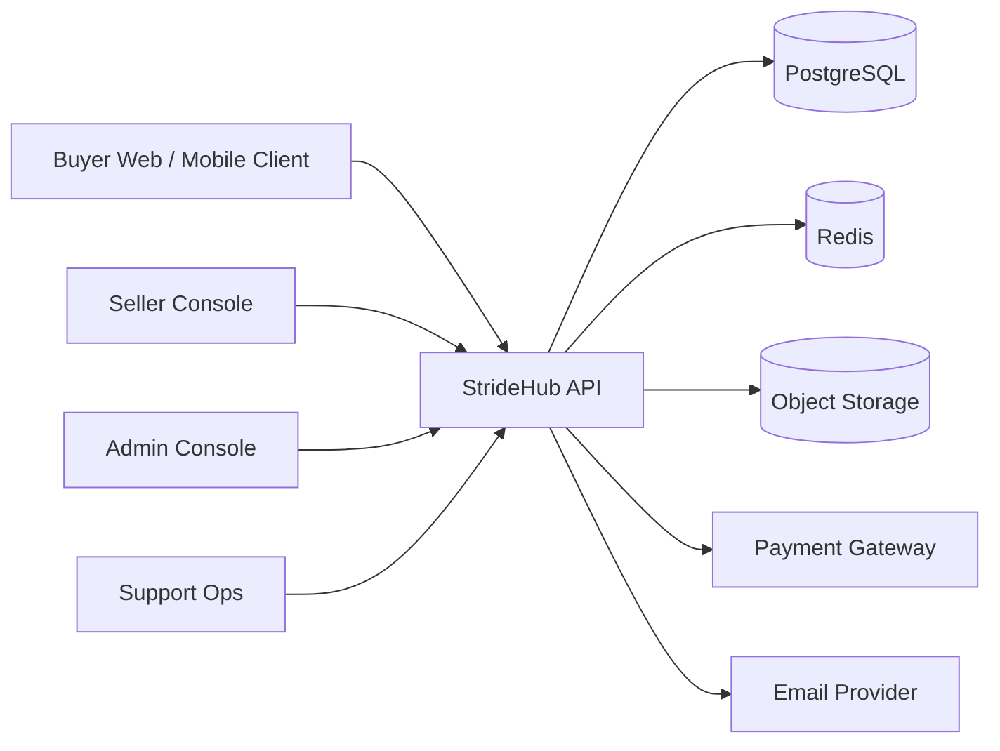
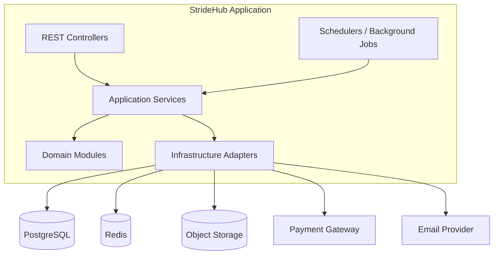
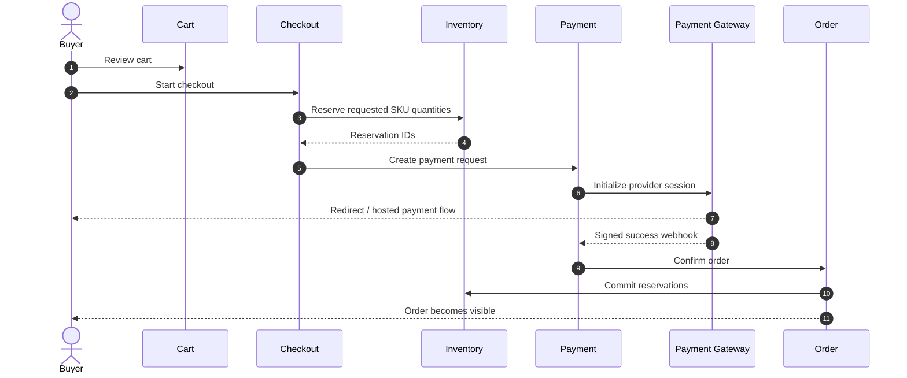
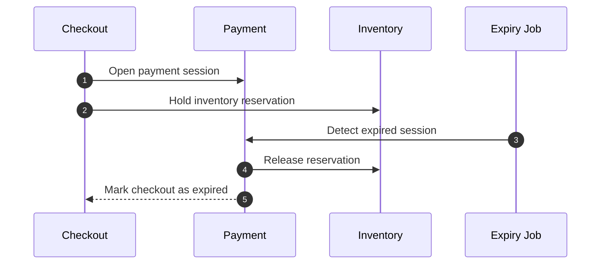
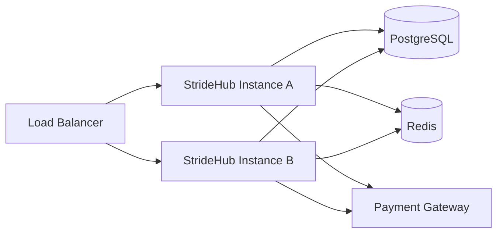

# StrideHub Architecture

## 1. Architectural Overview

StrideHub is designed as a `modular monolith` that models a real commerce platform without incurring the operational overhead of premature microservices. The architecture separates business domains into modules with explicit responsibilities while keeping deployment, local development, debugging, and transactional consistency manageable in the initial stages.

The system is optimized for a backend-heavy implementation with strong attention to:

- SKU-level inventory correctness
- idempotent payment processing
- order state integrity
- seller governance
- auditability and operational recovery

## 2. Architectural Drivers

### Functional Drivers

- multi-vendor catalog management
- variant-based commerce
- stock reservation during checkout
- payment gateway integration with webhook confirmation
- order lifecycle transitions
- seller onboarding and moderation

### Non-Functional Drivers

- maintainability in a single codebase
- transactional safety
- extensibility for future service extraction
- observability and operational clarity
- deterministic audit trails

## 3. System Context

## 4. Container View

## 5. Module Design

### Identity & Access

Responsibilities:

- registration and authentication
- refresh token rotation
- role-based authorization
- email verification and account state handling

Public contracts:

- `/auth/*`
- `/me/*`

### Seller Management

Responsibilities:

- seller application submission
- seller profile lifecycle
- seller approval and suspension

Public contracts:

- `/seller/applications`
- `/admin/sellers/*`

### Catalog

Responsibilities:

- category and brand management
- product and product variant modeling
- product publication workflow

Public contracts:

- `/catalog/*`
- `/seller/products/*`
- `/admin/products/*`

### Inventory

Responsibilities:

- stock tracking per variant SKU
- reservation, commit, release, and expiry

Public contracts:

- primarily internal module contracts
- seller-facing stock management endpoints

### Cart & Checkout

Responsibilities:

- buyer cart management
- checkout session lifecycle
- price and inventory revalidation

Public contracts:

- `/cart/*`
- `/checkout/*`

### Payment

Responsibilities:

- payment request orchestration
- payment attempt tracking
- webhook verification and idempotent callback handling
- reconciliation extension points

Public contracts:

- `/checkout/payment-intent`
- `/webhooks/payment/*`

### Order Management

Responsibilities:

- order creation
- order state transitions
- shipment placeholder and status tracking
- cancellation and return request entry points

Public contracts:

- `/orders/*`

### Admin & Audit

Responsibilities:

- privileged moderation actions
- operational overrides
- audit log persistence and search

Public contracts:

- `/admin/*`

## 6. Key Integration Principles

- External systems are accessed only through infrastructure adapters.
- Payment callbacks never mutate unrelated modules directly.
- Domain events are emitted through an outbox pattern.
- Cart is not the pricing source of truth; checkout revalidates business state.
- Product variant is the sellable unit; product itself is a merchandising aggregate.

## 7. Core Runtime Flows

### Checkout and Order Confirmation

### Payment Failure and Reservation Release

## 8. Data and Transaction Boundaries

- Each business transaction should remain within a single bounded context where possible.
- Payment confirmation and order creation should be coordinated through a controlled orchestration boundary, not a cross-module free-for-all.
- Side effects such as notifications and analytics should happen asynchronously from outbox events.

## 9. Security Model

- short-lived JWT access tokens
- rotating refresh tokens
- role-based authorization for buyer, seller, admin
- webhook signature verification
- audit logging for admin and finance-sensitive actions
- rate limiting for authentication, checkout, and webhook endpoints

## 10. Reliability Model

- optimistic locking on inventory hot rows
- reservation TTL with scheduled cleanup
- idempotent payment callback processing
- outbox-backed domain event publication
- explicit retry paths for provider and notification integrations

## 11. Observability

The platform should expose:

- structured JSON application logs
- correlation IDs per request and workflow
- metrics for checkout success, payment failures, reservation expiry, and admin interventions
- tracing hooks for later OpenTelemetry integration

## 12. Deployment Model

### Environment Targets

- Local: application + PostgreSQL + Redis + mock email/object storage
- Staging: sandbox gateway and seeded catalog
- Production: rolling or blue-green deployment with managed secrets and backups

Current baseline note:

- The repository already provisions PostgreSQL, Redis, Mailpit, and MinIO through `docker-compose.yml`.
- The application baseline currently integrates directly with PostgreSQL and Redis.
- Email delivery and object storage integrations are provisioned for local development but remain future module work.
