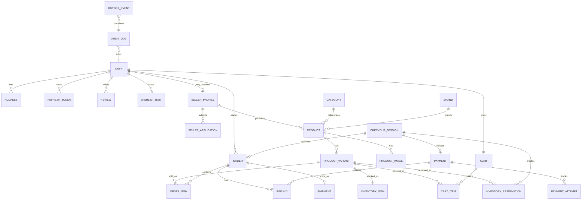
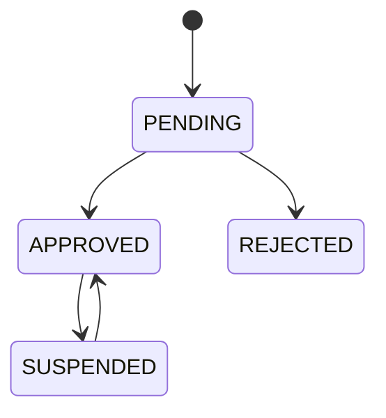
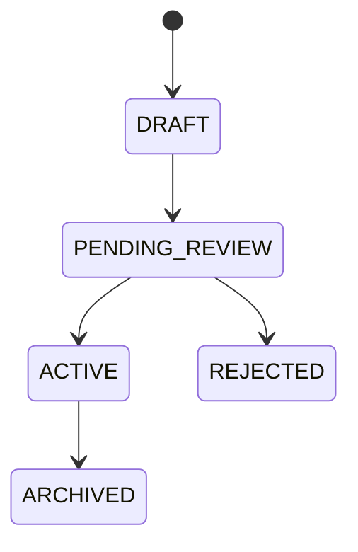
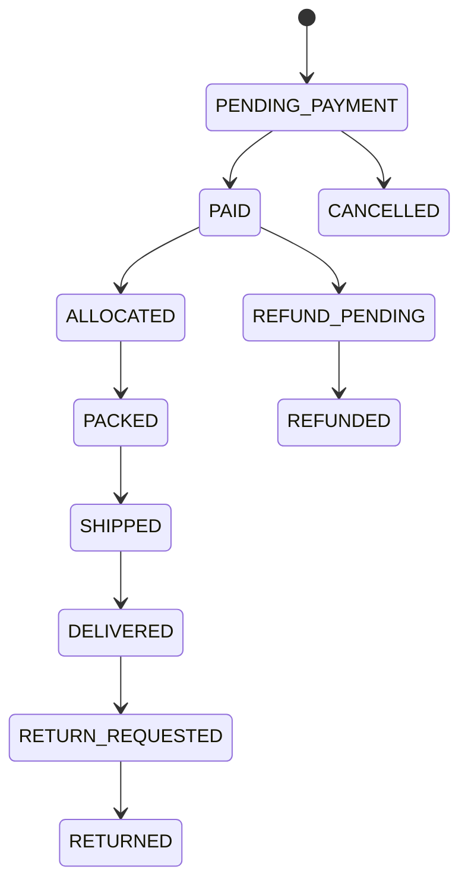
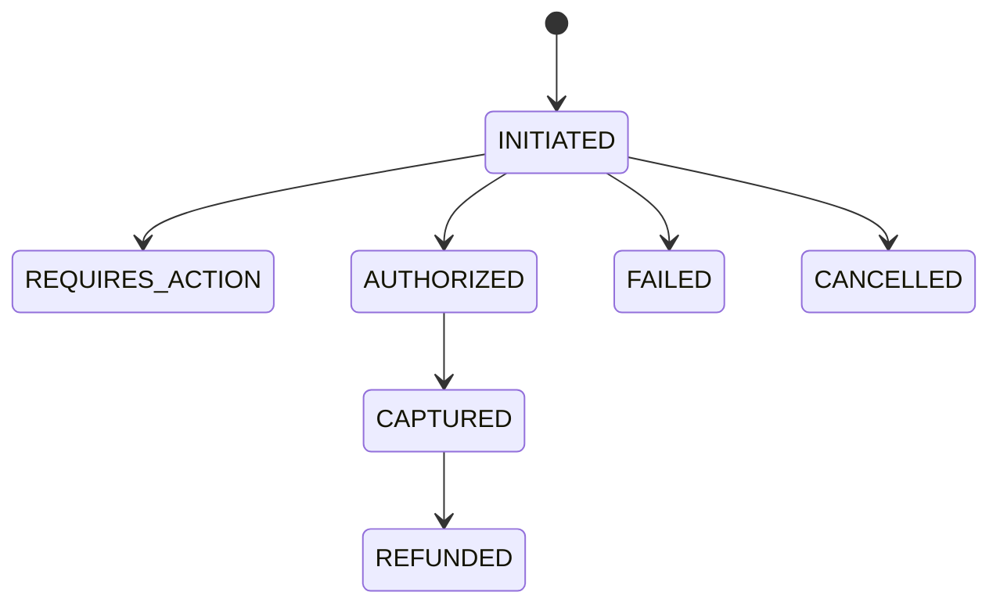
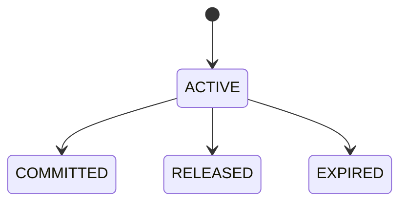

# StrideHub Domain Model

## 1. Domain Boundaries

StrideHub uses a domain model centered around commerce correctness and marketplace governance. The major business areas are:

- identity and access
- seller governance
- catalog
- inventory
- cart and checkout
- payments
- orders
- refunds
- audit and operations

## 2. Aggregate View

### User

Represents an authenticated platform identity. A user may become a seller through an application process and may own multiple addresses, refresh tokens, wishlist items, and orders.

### SellerProfile

Extends a user with seller-specific capabilities and status. Seller lifecycle is governed by approval and suspension rules.

### Product

Represents the merchandising entity visible to buyers. A product contains presentation-level metadata, publication status, and one or more sellable variants.

### ProductVariant

Represents the actual purchasable unit. This is the key business object for size, color, price selection, and stock control. Variant identity is anchored by SKU.

### InventoryItem

Represents available stock for a specific variant. Inventory changes are mediated by reservation and commit/release actions rather than naive decrements.

### Cart

Represents a buyer's pre-checkout basket. Cart data is advisory until checkout validation succeeds.

### CheckoutSession

Represents a structured attempt to transform a validated cart into a payment and, later, a confirmed order.

### Payment

Tracks a provider-backed payment lifecycle and all attempts associated with that lifecycle.

### Order

Represents the post-payment commercial commitment and becomes the central record for fulfillment, cancellation, and refund coordination.

## 3. Entity Relationship Diagram

## 4. Lifecycle Models

### Seller Status

### Product Status

### Order Status

### Payment Status

### Inventory Reservation Status

## 5. Invariants

- A product cannot be purchased without selecting a variant.
- A variant must have a unique SKU.
- Inventory is tracked at variant level only.
- Cart prices are not authoritative at payment time.
- Orders can be confirmed only after a valid payment event.
- Refunds must reference both an order and a payment context.

## 6. Suggested Index Strategy

- `product_variants(sku)` unique
- `inventory_items(product_variant_id)` unique
- `inventory_reservations(status, expires_at)`
- `orders(user_id, created_at desc)`
- `payments(provider_reference)` unique
- `audit_logs(correlation_id)`

## 7. Domain Modeling Notes

- `Product` should carry merchandising and discovery concerns.
- `ProductVariant` should carry purchasable properties.
- `InventoryReservation` should exist as a first-class business entity, not just a transient cache entry.
- `AuditLog` and `OutboxEvent` should be explicit persistence concerns because supportability and asynchronous integrity are design goals, not later add-ons.
